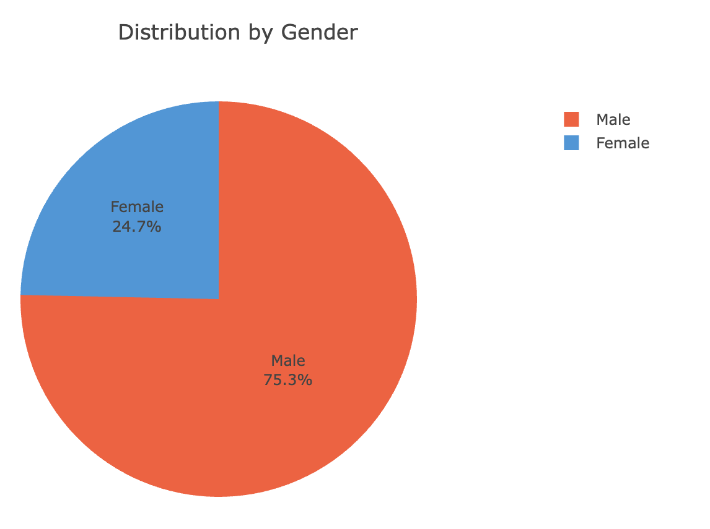
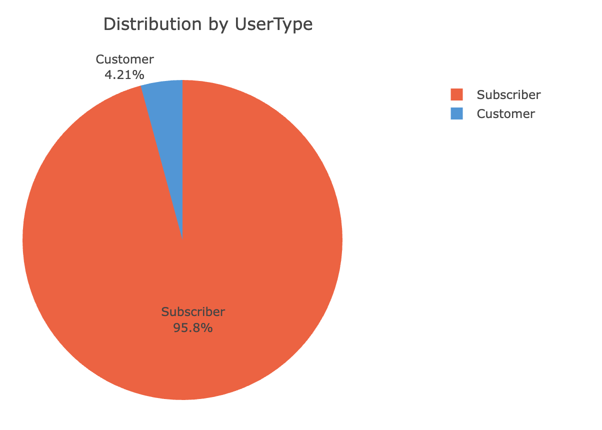
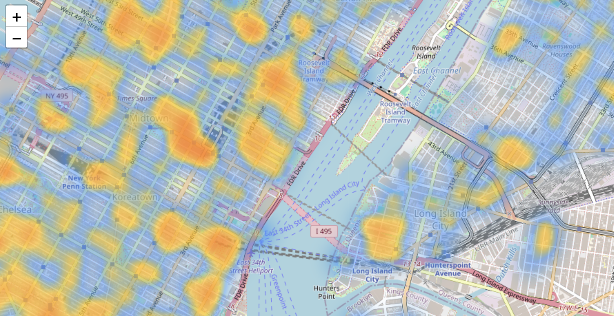

# Citi Bike HTML Project

This project is a web-based data visualization and analysis tool built using **VS Code, HTML, CSS, JavaScript, Leaflet, and Plotly JS**. 

### Live Demo:
Access the project [here](https://datasciencedallas2025.github.io/citiBike_B/).

### Data Source:
Data was sourced from the [Citi Bike Trip Data](https://s3.amazonaws.com/tripdata/index.html) for the year **2018**. A random sample was taken to maintain data integrity during the analysis.

### Key Findings:
- **User Types:** 95.8% of the users were Subscribers.
- **Gender Distribution:** Males accounted for 75.3% of users.
- **Top Birth Years:** The top 5 birth years ranged from **1988 to 1992**.

### Technologies Used:
- **HTML/CSS/JavaScript:** Structure, styling, and interactivity.
- **Leaflet JS:** Mapping and geospatial visualization.
- **Plotly JS:** Data visualization and interactive charts.

